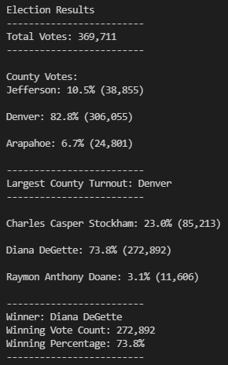

# Election_Analysis

##Project Overview:

A colorado Board of Elections employee has given you the following tasks to complete the election audit of a recent local congeressional election.  We have set out to find the answers to the following:

1. Calculate the total number of votes cast.
2. Get a complete list of candidates who recieved votes.
3. Calculate the total number of votes each candidate received.
4. Calculate the percentage of votes each candidate won.
5. Determine the winner of the election based on popular vote.

##Resources

 Data Source: election_results.csv
 Software: Python 3.7.6, Visual Studio Code, 1.56.0

##Election-Audit Results:

###Election Results
-------------------------
Total Votes: 369,711
-------------------------

County Votes:
Jefferson: 10.5% (38,855)
Denver: 82.8% (306,055)
Arapahoe: 6.7% (24,801)
-------------------------
Largest County Turnout: Denver
-------------------------
Charles Casper Stockham: 23.0% (85,213)
Diana DeGette: 73.8% (272,892)
Raymon Anthony Doane: 3.1% (11,606)
-------------------------
Winner: Diana DeGette
Winning Vote Count: 272,892
Winning Percentage: 73.8%
-------------------------

This chart is also available using this link: 

##Election-Audit Summary:
The audit of the election shows that:

With the information at hand using "election_results.csv" we determined that there were 3 candiates in the election over 3 counties.  The candidates in the election were Charles Casper Stockham, Diana DeGette, and Raymon Anthony Doane.  While the election took place in Arapahoe, Denver and Jefferson Counties.  The congressional election contained 369,711 votes.  Diana DeGette was declared the winner with 73.8% (272,892 votes) of the popular vote.  Denver County had the largest voter turnout in the election with 82.8% (306,055) of votes cast in the election.  See the above for a list containing all the information we recorded.
    
##Election-Audit Proposal:
With the script we have produced you will be able to find the accurate totals of any election with a few minor tweaks.  It is a matter of lining up the header rows to match the County and Candidates, as well as finding the proper path to the source file.
